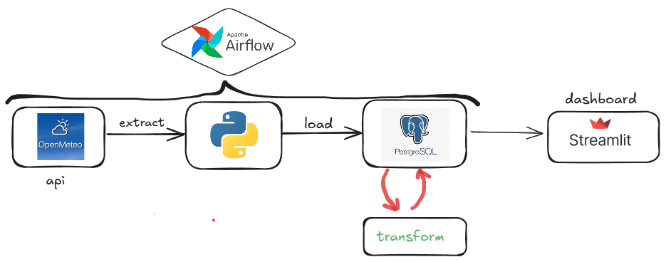

# Weather Data Pipeline

This project collects, processes, and analyzes weather data using **Apache Airflow**, **PostgreSQL**, and **Streamlit**. The pipeline fetches data from the Open-Meteo API, cleans and transforms it, and visualizes it in a Streamlit dashboard.

The project collects weather data starting from **2024-10-01** (arbitrary; you can choose any date you want). The location is set manually, so you can modify it to fetch data for any place in the world (check the API documentation for details).

After running the Airflow DAG, you can launch the Streamlit dashboard to visualize the processed data.

## Technologies Used
- **Apache Airflow**: Orchestrates the data pipeline.
- **PostgreSQL**: Stores the processed data.
- **Streamlit**: Visualizes the data in an interactive dashboard.
- **Python**: The programming language used for scripting.
- **Open-Meteo API**: Provides the weather data. 

